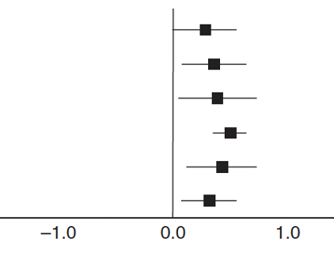
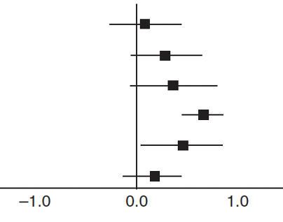
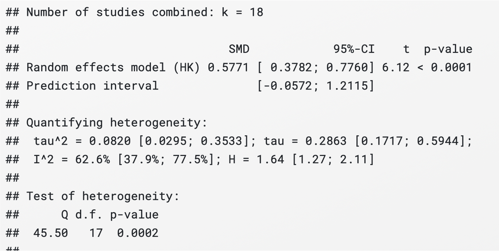
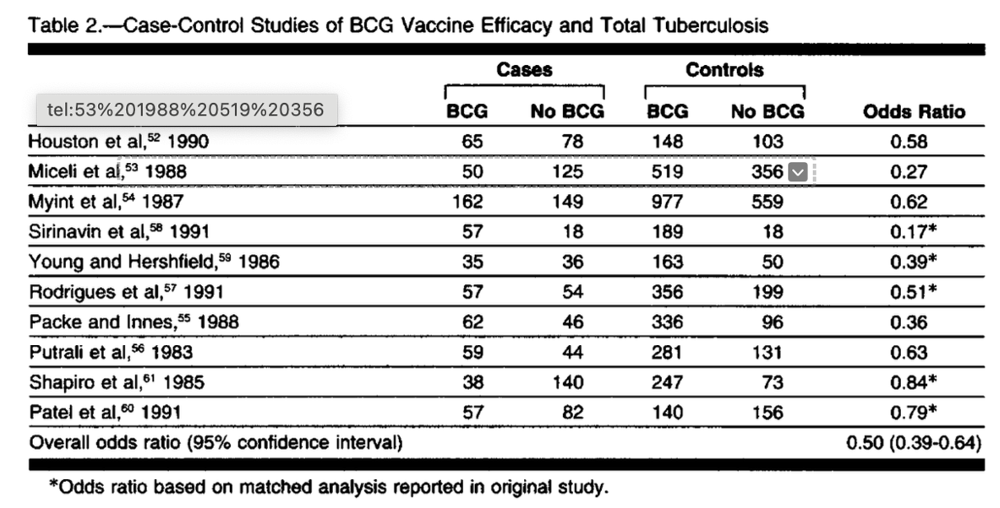
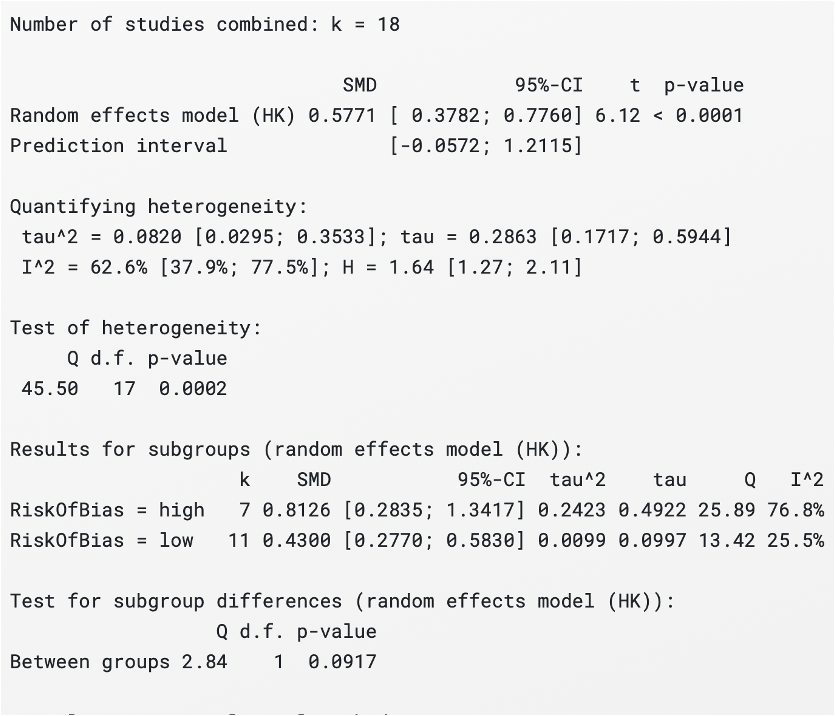
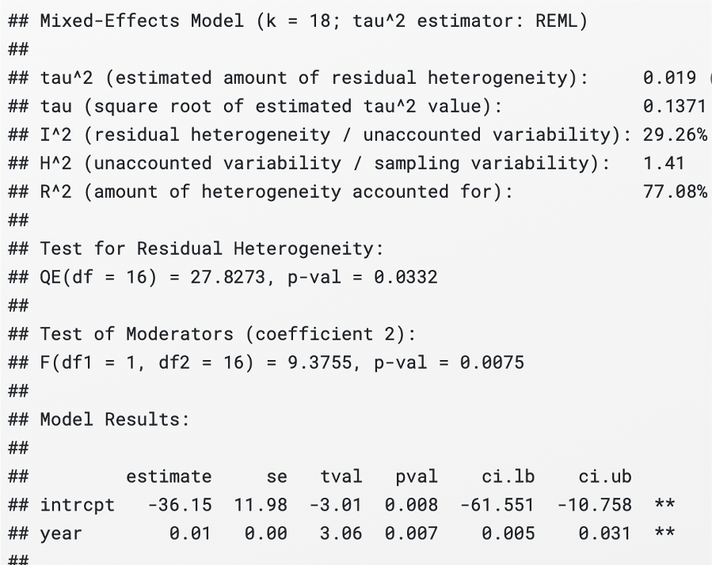
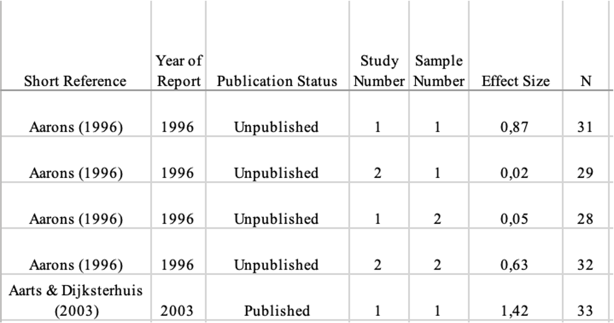
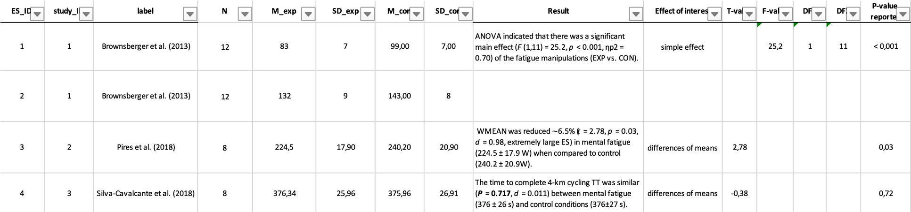

## What is a meta-analysis?

::: incremental
-   It combines effect sizes from multiple studies to calculate a single pooled effect size

-   It quantifies, for example, the effect of medication on systolic blood pressure, the prevalence of a disease, or the correlation between two variables, across a set of studies

-   It can only be applied to studies which report quantitative results
:::

## 

-   The goal is to estimate the true effect size ($\theta$) of an intervention/treatment

-   Individual studies provide estimates of the true effect size ($\widehat{\theta}$)

-   Why does $\widehat{\theta}$ differ from $\theta$?

## 

-   The estimate of the true effect size corresponds to:

$$
\theta = \widehat{\theta}_k + \epsilon_k
$$ where *k* refers to individual studies and $\epsilon_k$ is the sampling error

-   It is therefore desirable that the effect size estimate $\widehat{\theta}_k$ of study *k* is as close as possible to the true effect size, and that $\epsilon_k$ is minimal.

## 

-   Studies with larger sample sizes have smaller $\epsilon$

-   A common way to quantify $\epsilon$ is through the standard error (SE) $$
    SE = \frac{SD}{\sqrt{N}}
    $$ where SD is the standard deviation and *N* is the study sample size

## Example

### Study 1

```{r eval=TRUE, echo=TRUE}
# For reproducibility
set.seed(050990) 

# Simulate data
sample <- rnorm(n = 20, mean = 80, sd = 2)

# Calculate mean
mean(sample)
```

```{r eval=TRUE, echo=TRUE}
# Calculate SE
sd(sample)/sqrt(20)
```

## 

### Study 2

```{r eval=TRUE, echo=TRUE}
# For reproducibility
set.seed(050990)

# Simulate data
sample <- rnorm(n = 50, mean = 80, sd = 2)

# Calculate mean
mean(sample)
```

```{r eval=TRUE, echo=TRUE}
# Calculate SE
sd(sample)/sqrt(50)
```

## 

-   Study 2 has a larger sample size and therefore smaller SE

-   Studies with larger sample sizes tend to have smaller SE, which means $\epsilon_k$ is reduced relative to studies with smaller sample sizes

-   All else equal, the estimated effect size $\widehat{\theta}_k$ from a larger study is a more accurate estimate of the true effect $\theta$ than the estimate from a smaller study

## 

::: {#meta-fig2}
![Sample and standard errors as a function of sample size. Obtained from Harrer et al. [-@harrer2021]](images/fig2.png){#fig-fig2}
:::

## 

::: {#meta-fig3}
![Relationship between standard error and effect size estimates. Obtained from Harrer et al. [-@harrer2021]](images/fig3.png){#fig-fig3 width="60%"}
:::

## A meta-analysis is not only the average of effect sizes

-   It weights effect sizes to assign greater influence to studies with smaller SE and therefore greater statistical precision

-   Statistical precision refers to how accurately a study estimates the true effect size

-   The larger the sample size of studies included in a meta-analysis (*N*) and the larger the number of studies (*k*), the greater the statistical precision of the meta-analysis

## Type of meta-analyses

## Fixed Effect (FE) meta-analysis

-   It assumes that one true effect size underlies all the studies in the meta-analysis, thus the term "Fixed Effect"

-   Any differences in observed effects are due to sampling error $$
    \theta_k = \theta + \epsilon_k 
    $$

where $\theta_k$ is the study effect size, $\theta$ is the true effect size and $\epsilon_k$ is the study sampling error

-   Assumption of independent effect sizes

## FE meta-analysis

-   A FE meta-analysis simply use a weighted average of all studies to calculate the pooled effect size

-   The weight of an individual study ($w_k$) is calculated as follows: $$
    w_k = \frac{1}{SE^2_k}
    $$ $$
    \widehat{\theta} = \frac{\sum_{k=1}^{K}\widehat{\theta_k} w_k}{\sum_{k=1}^{K} w_k}
    $$

-   Multiply each study’s effect size $\widehat{\theta}$ with its corresponding weight $w_k$, sum the results across all studies *k* in our meta-analysis, and then divide by the sum of all the individual weights $w_k$

## Random Effect (RE) or two-level meta-analysis

-   Unlike the FE meta-analysis, the RE meta-analysis has two sources of error: the sampling error ($epsilon_k$) and differences (heterogeneity) among studies ($\zeta_k$)

-   Assumption of independent effect sizes

## RE meta-analysis

-   The RE model implies there are two levels to estimate the pooled effect size:

First level: $$
    \widehat{\theta_k} = \theta_k + \epsilon_k 
$$

where $\theta_k$ is the study effect size, $\theta_k$ is the true effect size of one single study *k* and $\epsilon_k$ is the study sampling error

Second level: $$
    \theta_k = \mu + \zeta_k 
$$

where $\theta_k$ is the study effect size, $\mu$ is the true effect size and $\zeta_k$ is the second source of error

- By plugging the second formula into the first one, the RE model can be expressed as follows:
$$
    \widehat{\theta_k} = \mu + \zeta_k + \epsilon_k
$$

## RE model

::: {fig-conceptual}
![Conceptual overview of a two-level meta-analysis. Obtained from Harrer et al. [-@harrer2021]](images/fig14a.png){#fig-conceptual}
:::

# 

- To calculate individual study weights $w_k$ in the RE model we have to take the second source of error $\zeta_k$ into account

- To do this, we have to estimate the variance of the distribution of true effect sizes ($\tau_2$)

- The weight of an individual study ($w_k$) is calculated as follows: $$
    w_k = \frac{1}{SE^2_K + \tau^2}
    $$

-   Just like with the FE model, the pooled effect size is calculated as follows: $$
    \widehat{\theta} = \frac{\sum_{k=1}^{K}\widehat{\theta_k} w_k}{\sum_{k=1}^{K} w_k}
    $$

## Multi-level or three-level meta-analysis

-   No assumption of independent effect size

-   Most common source of dependency: extracting more than one effect size per study

## 

::: {#meta-fig1}
![An overview of the meta-analysis process. Obtained from Harrer et al. [-@harrer2021]](images/fig1.png){#fig-fig1}
:::

## Why to conduct a meta-analysis?

## 

::: incrmental
-   To synthesize results from a set of studies which, individually, may lack the statistical power to detect the effect

-   Reduce the uncertainty around the true effect size
:::

## 

::: {meta-fig4}
![The effect of therapeutic intervention on myocardial infection Lau et al. [-@laucumulative1992].](images/fig4.png){#fig-fig4 width="70%"}
:::

## What do we need to conduct a meta-analysis?

- Effect sizes: standardized or non-standardized

- Variance of the effect sizes

- Formulas for effect sizes and variances depend on the type of effect size and the study design (e.g., within-subject design, between-subject, split-plot)

- See Jané et al. [-@jane] for a guide to calculating effect and variances for different study designs

## Calculating a standardized effect size for a two-group desing (between-subject)

- Standardized effect size (Cohen's $d_s$): 
$$
    d_s = \frac{ \bar{x}_1 - \bar{x}_2 }{SD}
$$

-   Cohen's $d_s$  variance:
$$
    V_d = \frac{ n_1 + n_2 }{n_1n_2} + \frac{ d^2 }{2(n_1n_2)}
$$

## 

::: {#meta-fig5}
![Conceptual overview of types of effect sizes. Obtained from Harrer et al. [-@harrer2021]. sizes.](images/fig5.png){#fig-fig5 width="70%"}
:::

## Which study and effect size to select?

-   The ones that are central to the research question

-   The goal of a meta-analysis is to combine studies that are fairly "similar".

-   Imagine the absurd scenario where a researcher decides to combine studies on the effect of yoga on stress levels and the effect of a medication on blood glucose in diabetic patients in one meta-analysis

## Avoid combining "apples and oranges"

How do we make sure we select similar studies?

## The PICO framework

-   The PICO framework is used to formulate a focused research question for a systematic review or meta-analysis.

-   It helps create a clear, answerable question by breaking it down into four key components

-   Population/Patient, Intervention, Comparison/Control, and Outcome.

## 

::: incremental
-   Population: What kind of participants do studies have to include to be eligible for a meta-analysis?

-   Intervention: What kind of intervention do studies have to examine?

-   Comparator: What kind of control group do studies have to use? A control group receiving a placebo? Waitlists? Another intervention? Nothing at all?

-   Outcome: What kind of outcome do studies have to measure? Systolic blood pressure? Fat mass? $VO_{2MAX}$?
:::

## Why to conduct a meta-analysis?

::: incremental
-   To synthesize results from a set of studies which, individually, may lack the statistical power to detect the effect

-   Reduce the uncertainty around the true effect size

-   **To explain effect-size heterogeneity**
:::

## What is effect-size heterogeneity?

The extent to which effect sizes vary within a meta-analysis. It is very important to assess heterogeneity in meta-analyses, as high heterogeneity could be caused by between-studies differences known as moderators.

Very high heterogeneity could even mean that the studies have nothing in common, and that there is no “real” true effect behind our data, due to mixing "apples and oranges".

## What does heterogeneity look like?

::: {layout-ncol="2"}
{#fig-fig6a}

{#fig-fig6b}
:::

## Heterogeneity statistics

## 

Cochran's *Q*

-   *Q* is used to check if there is an excess of variation beyond it can be expected from sampling error alone

-   *Q* increases both when the number of studies *k* increases, and when the precision (the sample size *N* of a study).

-   Whether the *Q*-test is significant highly depends on the size of the meta-analysis and thus its statistical power.

## 

$I^2$

-   It measures the percentage of variability not caused by sampling error.

$$
I^2 = \frac{Q - (K - 1)}{Q}
$$

-   It is insensitive to the number of studies

-   If studies become increasingly large, the sampling error tends to zero, while at the same time, $I^2$ tends to 100% simply because the studies have a greater sample size.

## 

Heterogeneity variance ($\tau^2$) & Standard deviation ($\tau$)

-   Taking the square root of $\tau^2$ results in $\tau$, which is the standard deviation of the true effect sizes

-   $\tau$ is is expressed on the same scale as the effect size metric

-   It is insensitive to the number of studies and sample size of studies.

-   It is hard to interpret. How do we interpret if $\tau_2$ = 0.1 is observed?

## 

Prediction Interval (PI)

-   PI represents a range into which the effects of future studies can be expected to fall based on current evidence

-   For example, if the PI only include positive numbers it means that, despite varying effects, the intervention is expected to be beneficial in future studies

## Conducting a meta-analysis in R

::: {meta-fig7}
{#fig-fig7}
:::

## What if there is heterogeneity?

Conduct a moderator analysis:

-   Subgroup analysis
-   Meta-regression

## 

Conducting a subgroup analysis/meta-regression requires additional information. Examples of moderators:

-   Risk of bias
-   Year
-   Sex
-   Dose
-   Age
-   ...

## 

::: {meta-fig8}
{#fig-fig8}
:::

## 

-   Colditz et al (1992) performed a moderator analysis to investigate sources of heterogeneity

-   The found that the efficacy of BCG vaccination depended on the latitude. That is, it increased with increasing distance from the equator

## Subgroup analysis with *meta*

::: {meta-fig9}
{#fig-fig9}
:::

## Subgroup analysis: Test for subgroup differences and forest plot

::: {meta-fig10}
![Subgroup analysis using the presence of statin treatment as a moderator. Obtained from Gelbenegger et al. [-@gelbenegger2019]](images/subgroup.png){#fig-subgroup}
:::

## Meta-regression with *meta*

::: {meta-fig10}

:::

## 

-   Do not mindlessly conduct moderator analyses as this increases the the type I error rate

-   Moderator analyses should be based on theoretical grounds

## Statistical threats to meta-analysis

::: incremental
-   Violating the assumption of independence

-   Ignoring outliers
:::

## Assumption of independent effect sizes

::: {meta-fig11}
{#fig-fig11}
:::

## Dependent effect sizes are common in practice

::: {meta-fig12}
{#fig-fig12}
:::

## 

::: {meta-fig13}
{#fig-fig13 width="80%"}
:::

## 

If one or more studies contribute more than one effect size then a multi-level meta-analysis is required

## 

::: {meta-fig14b}
![Conceptual overview of a three-level meta-analysis.Obtained from Harrer et al. [-@harrer2021]](images/fig14b.png){#fig-fig14b}
:::

## Ignore outliers

::: {meta-outlier}
{#fig-outlier}
:::

## Sources of outliers

-   Measurement error

-   Typing error

-   Using the Standard Error of Measurement (SEM) instead of SD

## Using SEM instead of SD

Correct ES calculation $$
d_s = \frac{\bar{x}_1 - \bar{x}_2}{SD} = \frac{14.4 - 13.8}{1.3} = 0.23
$$

Incorrect ES calculation $$
SEM = \frac{SD}{\sqrt{N}}
$$

$$
d_s = \frac{14.4 - 13.8}{SEM}  = \frac{14.4 - 13.8}{1.3 /\sqrt{40}} = 2.68
$$

## Consequences on meta-analyses

::: {#fig-outlier2 width="80%"} :::

## Computational reproducibility

The process of reusing the same analysis using the same data and obtaining the same results

## Data sharing

::: {baddata}
{#fig-baddata width="80%"}
:::

## 

::: {gooddata}
{#fig-gooddata width="80%"}
:::

## Code sharing

"Reproducibility rate rose by almost 40% when the analysis code was provided" [@laurinavichyute2022]

## References

::: refs
:::
