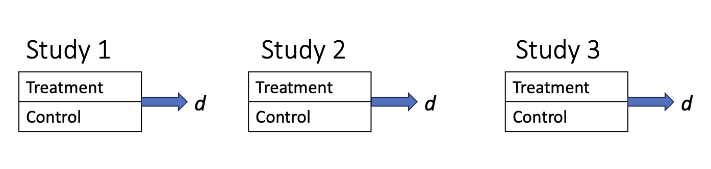
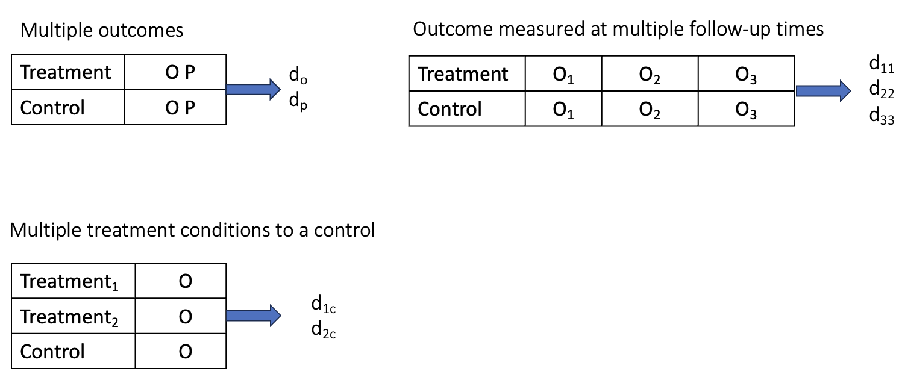
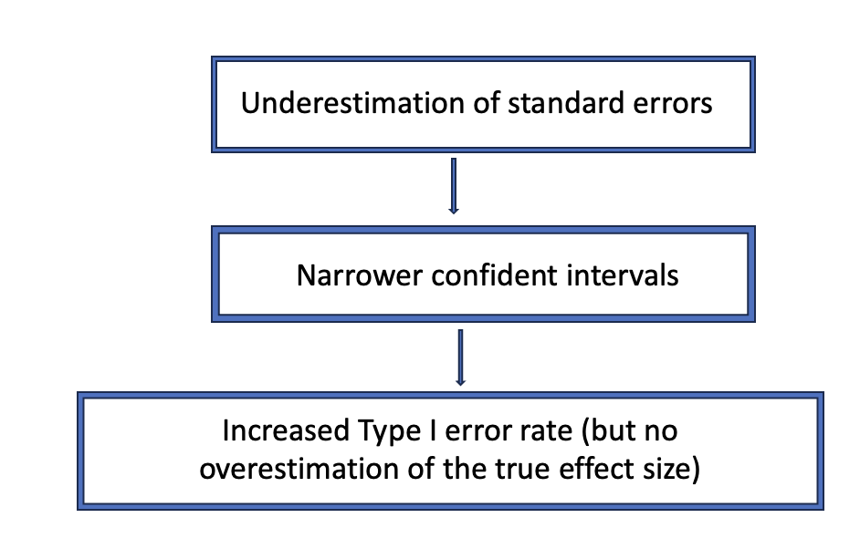
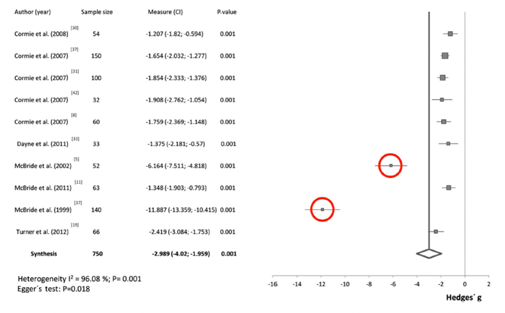
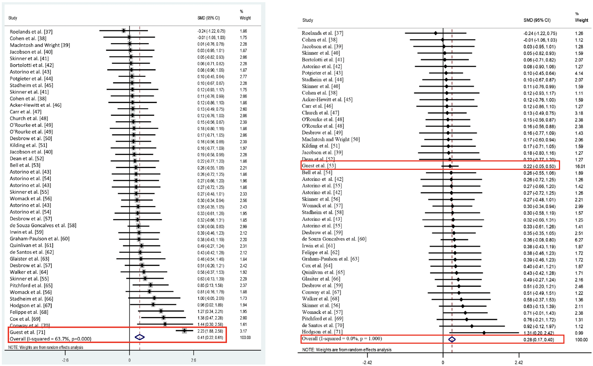

```{r}
#| include: FALSE

library(metadat)
library(meta)
library(flextable)
library(dplyr)
library(ggplot2)

dat <- dat.baskerville2012
```

# Scan QR code for slides

<div style="text-align: center;">

{width="400"}

</div>

# Lecture objective

By the end of this lecture, you should be able to interpret:

- Meta-analysis results

- Between-study heterogeneity

- Subgroup/Meta-regression analysis

- Bias-detection tests

# The Research Question

## What is your research question?

- Suppose you are a researcher working for a **government ministry**

- You need to gather evidence to make an informed decision about the **efficacy of an intervention**

- You conduct a **systematic search of the published literature** to identify all relevant studies

- But...which ones?

## Which studies and effect size should we select?

- The ones that are central to **the research question**

- A meta-analysis aims to combine studies that are fairly "similar".

- Imagine the absurd scenario where a researcher combines:

  - studies on the effect of yoga on stress levels, and

  <!-- -->

  - studies on the effect of a medication on stress levels

## Avoid combining "apples and oranges"

How do we make sure we select similar studies?

## The PICOS framework

- The PICOS framework is used to formulate a focused research question for a systematic review or meta-analysis.

- It helps create a clear, answerable question by breaking it down into four key components

- Population/Patient, Intervention, Comparison/Control, Outcome and Study Design

## The PICO framework

::: incremental
- **Population**: What kind of participants do studies have to include to be eligible for a meta-analysis?

- **Intervention**: What kind of intervention do studies have to examine?

- **Comparator**: What kind of control group do studies have to use? A control group receiving a placebo? Waitlists? Another intervention? Nothing at all?

- **Outcome**: What kind of outcome do studies have to measure? Systolic blood pressure? Dyastolic blood pressure? Mortality?

- **Study design:** Which study designs are eligible? Randomized Controlled Trials (RCTs), pre-post, etc. Different study designs require **different effect-size calculations**
:::

# Effect sizes

## What do we need to conduct a meta-analysis?

- Effect size (or the information to compute it) for each study

  - Standardized (e.g., Cohen's $d$ or Pearson's $r$)

  - Non-standardized (mean difference, odds ratio ($OR$)

- Sampling variance (or standard error) of each effect size

## Types of effect sizes

- The formulas for calculating effect sizes and their variances depend on:

  - The type of effect size: $d_s$, $d_z$, $r$, etc.
  - The study design (e.g., within-subject design, between-subject, split-plot)

- See Jané et al. [-@jane] for a guide to calculating effect and variances across different study designs

## Calculating Cohen's $d_s$ effect size (between-subject)

Standardized effect size (Cohen's $d_s$): $$  d_s = \frac{ \bar{x}_1 - \bar{x}_2 }{SD_{pooled}}$$

Cohen's $d_s$ variance: $$V_d = \frac{ n_1 + n_2 }{n_1n_2} + \frac{ d^2 }{2(n_1n_2)}$$

## Raw data

- Mean and SD for each group

- Sample size

| study_id | exp_mean | exp_sd | exp_n | con_mean | con_sd | con_n |
|----------|----------|--------|-------|----------|--------|-------|
| study_1  | 12.4     | 3.2    | 50    | 10.1     | 3.5    | 50    |
| study_2  | 15.2     | 4.1    | 40    | 13.8     | 3.9    | 42    |
| study_3  | 8.7      | 2.8    | 60    | 7.9      | 2.6    | 58    |
| study_4  | 21.3     | 5.2    | 35    | 18.6     | 4.8    | 37    |

## Calculating effect sizes {#sec-overview}

We can calculate effect sizes using:

- Functions from the **`meta`** package (see @fig-fig1).

  > Note that these functions calculate the effect sizes **and** perform the meta-analysis.

```{r}
#| echo: TRUE
#| eval: FALSE

metacont(
  n.e, mean.e, sd.e,
  n.c, mean.c, sd.c,
  data = ...
)
```

- The `escalc()` function from the **`metafor`** package, which calculates effect sizes without fitting a meta-analytic model.

## Functions from `meta`

::: {#meta-fig5}
![Overview of functions for calculating different types of effect sizes using the `meta` package. Obtained from Harrer et al. [-@harrer2021]](images/fig5.png){#fig-fig1 width="700"}
:::

# The basics of Meta-analysis

## Plotting the effect sizes

- Suppose we have identified 20 studies in our systematic review

- You might have notice that effect sizes vary across studies

```{r}
set.seed(123)

# Simulation parameters
n_studies <- 20
true_d <- 0.5

# Simulate studies with different sample sizes
dat <- tibble(
  study = 1:n_studies,
  n = sample(c(30, 50, 100, 200), n_studies, replace = TRUE)
) %>%
  mutate(
    # Sampling variance of Cohen's d (approximation)
    se = sqrt(2 / n),
    
    # Observed effect size
    d = rnorm(n_studies, mean = true_d, sd = se)
  )

ggplot(dat, aes(x = d, y = study)) +
  geom_vline(
    aes(xintercept = true_d, linetype = "True effect size"),
    linewidth = 0.8
  ) +
  geom_point(size = 3) +
  scale_linetype_manual(
    values = "dashed",
    name = NULL
  ) +
  labs(
    x = "Observed effect size (Cohen's d)",
    y = "Study"
  ) +
  theme_classic()
```

## Why do effect sizes differ across studies?

- Individual studies provide estimates of the true effect size ($\widehat{\theta}$)

- By combining estimates from multiple studies, we can obtain a more precise estimate of the true effect size

- Why does $\widehat{\theta}$ differ from $\theta$?

$$\theta = \widehat{\theta}_k + \epsilon_k$$ where *k* refers to individual studies and $\epsilon_k$ is the sampling error

## Effect size estimate and sampling error

It is therefore desirable that the effect size estimate $\widehat{\theta}_k$ of study *k* is as close as possible to the true effect size, and that $\epsilon_k$ is minimal.

## Sampling error ($\epsilon$)

- Studies with larger sample sizes have smaller $\epsilon$

- A common way to quantify $\epsilon$ is through the Standard Error ($SE$) $$SE = \frac{SD}{\sqrt{N}}$$where $SD$ is the standard deviation and $N$ is the study sample size

## Standard error as a function of sample size

::: {#meta-fig2}
![Mean and standard errors as a function of sample size. Obtained from Harrer et al. [-@harrer2021]](images/fig2.png){#fig-fig2}
:::

## The smaller SE, the more accurate the effect size estimate

::: {#meta-fig3}
![Relationship between standard error and effect size estimates. Obtained from Harrer et al. [-@harrer2021]](images/fig3.png){#fig-fig3 width="60%"}
:::

## A meta-analysis is not only the average of effect sizes

- It weights effect sizes to assign greater influence to studies with smaller $SE$ and therefore greater statistical precision

- Statistical precision refers to how accurately a study estimates the true effect size

- The larger the sample size of studies included in a meta-analysis ($N$) and the larger the number of studies (*k*), the greater the statistical precision of the meta-analysis

## Type of meta-analyses

## Fixed-Effect (FE) meta-analysis

- It assumes that one true effect size underlies all the studies in the meta-analysis, thus the term "Fixed Effect"

- Any differences in observed effects are due to sampling error $$\theta_k = \theta + \epsilon_k $$

where $\theta_k$ is the study effect size, $\theta$ is the true effect size and $\epsilon_k$ is the study sampling error

- Assumption of independent effect sizes

## FE meta-analysis

- A FE meta-analysis simply use a weighted average of all studies to calculate the pooled effect size

- The weight of an individual study ($w_k$) is calculated as:

  $$w_k = \frac{1}{SE^2_k}$$

- The pooled effect size ($\widehat{\theta}$) is calculated as:

  $$\widehat{\theta} = \frac{\sum_{k=1}^{K}\widehat{\theta_k} w_k}{\sum_{k=1}^{K} w_k}$$

## Random-Effect (RE) or two-level meta-analysis

- Assumption of independent effect sizes

- Unlike the FE meta-analysis, the RE meta-analysis recognizes two levels of variation:

  - Within-study variation due to sampling error ($\epsilon_k$)

  - Between-study heterogeneity ($\zeta_k$)

## Sources of variation

**Level 1**: Sampling error (within-study variation) $$    \widehat{\theta_k} = \theta_k + \epsilon_k $$

where $\theta_k$ is the study effect size, $\theta_k$ is the true effect size of one single study *k* and $\epsilon_k$ is the study sampling error

**Level 2**: Between-study variation $$    \theta_k = \mu + \zeta_k $$

where $\theta_k$ is the study effect size, $\mu$ is the mean of the distribution of true effect sizes and $\zeta_k$ is the deviation of study $k$'s true effect from $\mu$

## RE Meta-analysis

- Combining the two levels gives: $$  \widehat{\theta_k} = \mu + \zeta_k + \epsilon_k$$

- The model therefore separates sampling error from between-study variation

- This second source of variation allows us to quantify between-study heterogeneity

## What is between-study heterogeneity?

- **Between-study heterogeneity** refers to differences in the **true effect sizes** across studies

- Studies may differ in their participants, interventions, comparators, outcomes, settings, or other characteristics

- Heterogeneity is important because it tells us whether the studies are estimating a **common effect** or different effects

## RE Meta-analysis

- The weight of an individual study ($w_k$) is: $$  w_k = \frac{1}{SE^2_K + \tau^2}
    $$

<!-- -->

- The pooled effect size is calculated as follows: $$\widehat{\theta} = \frac{\sum_{k=1}^{K}\widehat{\theta_k} w_k}{\sum_{k=1}^{K} w_k}$$

## Multi-level or three-level meta-analysis

- Does **not assume that all effect sizes are independent**

- A common source of dependency is **multiple effect sizes extracted from the same study**

- Multilevel models can account for the **hierarchical structure** of the data

- For more information, see [Chapter 10 of Doing a Meta-analysis in R](https://doing-meta.guide/multilevel-ma)

# Doing a meta-analysis in R

## First we need a dataset

We will use the **`metadat::dat.baskerville2012`** dataset. It contains 23 studies on the effectiveness of practice facilitation interventions within the primary care practice setting. The meta-analysis is available [here](https://pmc.ncbi.nlm.nih.gov/articles/PMC3262473/)

```{r}
#| echo: TRUE
# Load dataset
dat <- dat.baskerville2012 

# Display first 5 rows as a table and color the last two columns
dat |> 
  head(5) |> 
  flextable() |> 
  color(j = c(17, 18), color = "red", part = "all")
```

## The function `metagen()`

- We use the `metagen()` function because the dataset contains **precalculated effect sizes and their standard errors**

- The appropriate function depends on:

  - The **type of effect size**

  - Whether the **effect sizes need to be calculated from the raw study data**

- See @sec-overview for an overview of the different functions

```{r}
#| echo: TRUE
meta <- metagen(TE = smd,              # standardized effect size
                seTE = se,             # standard error
                data = dat[c(1:15), ], # dataset
                prediction = TRUE)     # prediction interval
```

## `metagen()` output

```{r}
#| echo: TRUE

# Print output
meta
```

## Reporting the main result

```{r}
#| echo: TRUE

# Print outputs
meta$TE.random    # Pooled effect size
meta$lower.random # Lower bound of 95% CI
meta$upper.random # Upper bound of 95% CI
meta$pval.random  # P-value of the Z-test
```

> The estimated pooled effect size was Cohen's $d_s$ = `r round(meta$TE.random, 2)`, 95% CI \[`r round(meta$lower.random, 2)`, `r round(meta$upper.random, 2)`\], $p$ = `r format.pval(meta$pval.random, digits = 3)`

## Forest plot

```{r}
#| echo: TRUE
forest(meta)
```

# Between-study heterogeneity

## What does between-study heterogeneity look like?

```{r}
forest(meta)
```

## Cochran's *Q*

- The *Q*-test assesses whether the observed variation in effect sizes is greater than would be expected from sampling error alone

- The *Q*-statistic increases both when the number of studies *k* increases, and when the precision (the sample size *N* of a study)

- Whether the *Q*-test is significant highly depends on the size of the meta-analysis and thus its statistical power

- If the Q-test returns a $p$-value smaller than 0.05, we reject the null hypothesis that the observed variation in effect sizes can be explained by sampling error alone

## Reporting Cochran's *Q*

```{r}
#| echo: TRUE
meta$Q      # Q-test statistic
meta$df.Q.  # degrees of freedom
meta$pval.Q # p-value
```

> The $Q$-test was significant, $Q$(`r meta$df.Q`) = `r round(meta$Q, 2)`, $p$ = `r format.pval(meta$pval.Q, digits = 3, scientific = FALSE)`, indicating that the observed variation in effect sizes is greater than would be expected from sampling error alone.

## $I^2$

- It measures the percentage of variability not caused by sampling error.

$$I^2 = \frac{Q - (K - 1)}{Q}$$

- It is insensitive to the number of studies

- If studies become increasingly large, the sampling error tends to zero, while at the same time, $I^2$ tends to 100% simply because the studies have a greater sample size.

## Interpreting $I^2$

- As a rough guide, @higgins2002 suggest:
  - **25%** → low heterogeneity
  - **50%** → moderate heterogeneity
  - **75%** → high heterogeneity

## Reporting $I^2$

```{r}
#| echo: TRUE

# Print I2
meta$I2
```

> The estimated $I^2$ was `r round(meta$I2, 2)*100`%, indicating **low between-study heterogeneity** according to Higgins et al. [-@higgins2002].

## $\tau^2$ and $\tau$

- $\tau^2$ is the variance of the distribution of true effect sizes across studies
- $\tau$ is the corresponding standard deviation
- $\tau$ is expressed on the same scale as the effect size
- Unlike $I^2$, $\tau$ provides information about the absolute magnitude of between-study heterogeneity
- Taking the square root of $\tau^2$ results in $\tau$, which is the standard deviation of the true effect sizes
- It is hard to interpret. How do we interpret if $\tau_2$ = 0.1 is observed?

## Reporting $\tau^2$ and $\tau$

```{r}
#| echo: TRUE
meta$tau2 # variance of the distribution
meta$tau  # SD of the variance
```

## Prediction Interval (PI)

- A prediction interval (PI) indicates the range in which the true effect of a future study is expected to fall

- It incorporates both: a) uncertainty around the pooled effect size and b) between-study heterogeneity

- If the PI includes both beneficial and harmful effects, the intervention's effect may differ substantially across settings

## Reporting Prediction Intervals

```{r}
#| echo: TRUE

meta$lower.predict # Lower bound of the PI
meta$upper.predict # Upper bound of the PI
```

> The 95% prediction interval was \[`r round(meta$lower.predict, 2)`, `r round(meta$upper.predict, 2)`\]. This represents the range in which the true effect of a new, similar study would be expected to fall, accounting for between-study heterogeneity.

## What causes between-study heterogeneity?

- Between-study heterogeneity can arise because studies differ in characteristics that **modify the effect**.

- Examples include: Risk of bias, Sex, Dose, Age, Type of intervention, etc.

- These characteristics are often called **moderators**.

## Explaining between-study heterogeneity

If studies differ in their true effects, we can investigate **potential moderators**:

- **Subgroup analysis** — for categorical moderators

- **Meta-regression** — for continuous or categorical moderators

::: callout-important
**Moderator analyses should be based on theoretical or substantive grounds, not conducted simply because heterogeneity is statistically significant.**
:::

## Subgroup analysis

- A subgroup analysis compares pooled effects across **categories of a moderator**

- We therefore need a **categorical moderator**

```{r}
#| echo: TRUE
glimpse(dat)
```

## Choosing a moderator

- For our subgroup analysis, we will use the `blind` variable

- It refers to whether the participants were blinded to the intervention

- This is a common moderator because **blinding** can mitigate several sources of bias which, if left unchecked, can quantitively affect study outcomes

```{r}
#| echo: TRUE
levels(as.factor(dat$blind))
```

# Subgroup analysis

- The test of interest is the `Test for subgroup differences`
- This $Q$-test is an omnibus test. It tests the null hypothesis that all subgroup effect sizes are equal, and is significant when at least two subgroups, or combinations thereof, differ.
- There are two: `common effect model`and `random effects model`

```{r}
#| include: FALSE
# Redo the meta-analysis using all studies; previously, we used a subset to fit all studies in the forest plot
meta <- metagen(TE = dat$smd, 
                seTE = se, 
                data = dat)
```

## Reporting subgroup analysis

```{r}
#| echo: TRUE
(meta_subgroup <- update(meta,              # meta object
                         subgroup = blind)  # Categorical moderator defining the subgroups
  )
```

> The test for subgroup differences was not significant, $Q$(`r meta_subgroup$df.Q.b.common`) = `r round(meta_subgroup$Q.b.fixed, 2)`, $p$ = `r format.pval(meta_subgroup$pval.Q.b.fixed, digits = 3, scientific = FALSE)`, indicating that the null hypothesis of no differences in effect sizes between subgroups could not be rejected

## Subgroup forest plot

We can use the `forest()` function to visualize the effect sizes and pooled estimates for each subgroup.

```{r}
#| echo: TRUE
#| out-width: 100%

# Create a meta-analysis using only studies with unblinded participants
meta_rct <- update(
  meta,
  subset = blind == "0"
)

# Plot the forest plot for this subgroup
forest(meta_rct)
```

## Meta-regression

- Meta-regression examines whether **moderators are associated with differences in effect sizes**

- Unlike subgroup analysis, meta-regression can be used with **continuous or categorical moderators**

## Meta-regression

We can perform a meta-regression using the `metareg()` function

```{r}
#| echo: TRUE

meta_reg <- metareg(meta,       # Meta object
                    ~ duration) # Continuous predictor

# Display the meta-regression results
meta_reg |>
  broom::tidy() |>
  select(-type) |>
  flextable()
```

- **Intercept:** the estimated pooled effect size

- **Duration:** estimated change in the effect size for a one-unit increase in duration

## Interpretation of the meta-regression

> Duration is not a statistically significant predictor of the effect size ($p$ = `r format.pval(meta_reg$pval[2], digits = 3, scientific = FALSE)`). The **slope of the meta-regression** ($\beta$ = `r round(meta_reg$beta[2], 3)`) is not significantly different from zero, indicating that the estimated effect size does not significantly change as intervention duration increases. Thus, longer interventions do not appear to be more effective than shorter interventions.

## Bubble plot

```{r}
#| echo: TRUE
#| out-width: 100%

# Plot bubble plot
bubble(meta_reg)
```

## Interpreting bubble plots

- Each bubble represents a study
- The bubble size reflects the study's precision
- The intercept is the estimated effect size
- The slope indicates how the estimated effect size changes as the moderator increases
- A positive slope would indicate that longer interventions increase the effectiveness of the intervention; A negative slope would indicate that longer interventions are associated with lower effectiveness; A flat slope indicates no association between intervention duration and effectiveness

# Threats to validity of meta-analysis

::: incremental
- Selection bias

- Violating the assumption of independence

- Ignoring outliers
:::

## Publication bias

- Publication bias occurs when the probability of a study being published depends on its results

- Studies with statistically significant or favorable results may be more likely to be published than studies with null or unfavorable results

- This can distort the scientific literature because unpublished findings cannot be included in a meta-analysis

- As a result, the estimated effect size may be overestimated

- **Small-study effects** refer to a broader pattern in which smaller studies tend to show different, often larger, effects than larger studies.

<!-- -->

- Publication bias is **one possible explanation** for small-study effects, but small-study effects can also arise for other reasons.

## Funnel plot

- In the absence of small-study effects, studies should roughly follow the funnel-shaped pattern shown in the plot

```{r}
#| echo: TRUE

# Produce funnel plot
funnel(meta,
       xlim = c(-1, 2),
       studlab = TRUE) # Add study label
```

## Interpreting the Funnel plot

- The pattern appears asymmetrical in the Funnel plot. This is because several small studies have very large effect sizes in the bottom-right corner (Studies 2, 22, 1 and 12)

- There are no comparable studies in the bottom-left corner to “balance out” these large effects

- This asymmetry may therefore indicate **small-study effects**, although other explanations are also possible

## **Contour-enhanced funnel plots**

- Similar to a standard funnel plot, but includes **shaded regions indicating different levels of statistical significance**

<!-- -->

- These contours help assess whether the asymmetry in the funnel plot is related to **statistical significance**

```{r}
# Define fill colors for contour
col.contour = c("gray75", "gray85", "gray95")

# Generate funnel plot
funnel(meta, 
       xlim = c(-1.5, 2),
       contour = c(0.9, 0.95, 0.99),
       col.contour = col.contour)

# Add a legend
legend(x = 1.2, 
       y = 0.01, 
       legend = c("p < 0.1", "p < 0.05", "p < 0.01"),
       fill = col.contour)
```

## Other causes of asymmetry

- **Between-study heterogeneity**: Funnel plots assume that the dispersion of effect sizes is due to sampling error. However, the studies may estimate different underlying true effects, which can produce asymmetry

- **Differences in study quality**: smaller studies may be more susceptible to bias and therefore report larger effect sizes. This can also lead to funnel plot asymmetry, even when there is no publication bias

<!-- -->

- **Chance:** It is possible that funnel plot asymmetry simply occurs by chance

## Trim & Fill method

- It adjusts for funnel plot asymmetry by imputing “missing” effects until the funnel plot is symmetric

- The pooled effect size of the resulting “extended” data set then represents the estimate when correcting for small-study effects

```{r}
#| echo: TRUE

# Conduct trim and fill method
(trim <- trimfill(meta))
```

## Interpreting `trimfill` output

- The trim and fill method added a total of 7 studies

- The corrected effect corresponds to a Cohen's $d_s$ = `r round(trim$TE.random, 2)`. This is still significant, but lower than the effect of $d_s$ =`r round(meta$TE.random, 2)` initially calculated for `meta`

- An important caveat pertaining to the trim-and-fill method is that it does not produce reliable results when the between-study heterogeneity is large

## Egger's regression test

- Egger's rest can only identify small-study effects

- When using Egger’s test, however, we are not interested in the size and significance of the regression coefficient ($\beta_1$), but in the intercept ($\beta_0$)

- If $\beta_0$ differs significantly from zero, Egger’s test indicates funnel plot asymmetry

## Egger's regression test

```{r}
#| echo: TRUE

(egger <- metabias(meta, 
                  method.bias = "linreg"))
```

> The intercept was `r round(egger$intercept, 2)`, which was significantly different from zero, $t$ = `r round(egger$statistic, 2)`, $p$ = `r format.pval(egger$pval, digits = 3, scientific = FALSE)`. This indicates funnel plot asymmetry, consistent with small-study effects. 

## PET-PEESE

- PET-PEESE combines two methods:

  - The precision-effect test (PET)

  - The precision-effect estimate with standard error (PEESE)

- Both methods use a meta-regression to account for small-study effects

- We first run PET and examine whether its intercept is significantly larger than zero. If we reject the null hypothesis, we we use the intercept of PEESE as the true effect size estimate

- If PET’s intercept is not significantly larger than zero, we remain with the PET estimate

## PET (Precision-Effect Test)

```{r}
#| echo: TRUE

# Perform PET test
PET <- metafor::rma(yi = smd, 
                    sei = se, 
                    mods = ~se, 
                    data = dat, 
                    method = "FE")

# Store results
res_pet <- PET |> 
  broom::tidy() |> 
  select(-type) 

# Display results of PET test
res_pet |> 
  flextable()
```

> The intercept of PET is `r round(res_pet[1, 2], 2)` and it is not statistically different from 0 ($p$ = `r round(res_pet[1, 5], 3)`). Therefore, we fail to reject the null hypothesis that the PET intercept is equal to 0 and use the PET estimate as the corrected effect size.

## PEESE (Precision-Effect Estimate with Standard Error)

If the PET intercept is statistically significantly different from 0, we use the PEESE intercept as the corrected pooled effect-size estimate.

```{r}
#| echo: TRUE

# Peform PEESE test
PEESE <- metafor::rma(yi = smd, 
                      sei = se, 
                      mods = ~I(se^2), 
                      data = dat, 
                      method = "FE")

# Display results of PEESE test
PEESE |> 
  broom::tidy() |> 
  select(-type) |> 
  flextable()
```

## P-curve

When interpreting p-curve’s results, we essentially try to answer two questions. The first one is:

- Does our p-curve indicate the presence of evidential value? This can be evaluated using the right-skewness tests.

- In case we can not confirm the presence of evidential value, we turn to the second question: is evidential value absent or inadequate? This can be assessed using the flatness tests

## `pcurve()` output

```{r}
pcurve <- dmetar::pcurve(meta)

pcurve$pcurveResults
```

## Interpreting the results of the `pcurve` method

- Evidential value present: The right-skewness test is significant for the half p-curve (p\< 0.05) or the p-value of the right-skewness test is \<0.1 for both the half and full curve.

- Evidential value absent or inadequate: The flatness test is significant with p\<0.05 for the full curve or the flatness test for the half curve and the binomial test are p\<0.1.

## Limitations of bias-detection tests

- All tests have **limitations** and should not be interpreted in isolation.
- Their performance can depend on the **number of studies**, the **sample sizes of the individual studies**, **between-study heterogeneity**, and assumptions about the underlying publication bias process.
- A non-significant test does not necessarily indicate the **absence of publication bias**, and a significant test does not necessarily prove that publication bias is present.
- The best approach is to use **triangulation**: apply several bias-detection methods and consider whether they provide a consistent results

## The assumption of independent effect sizes

- Standard meta-analysis methods assume that effect-size estimates are **independent**

- A common violation occurs when a study contributes **multiple effect sizes**

::: {meta-fig11}
{#fig-fig11}
:::

## Dependent effect sizes are common in practice

::: {meta-fig12}
{#fig-fig12}
:::

## Why is dependence a problem?

::: {meta-fig13}
{#fig-fig13 width="80%"}
:::

## How to deal with dependent effect sizes?

- If studies contribute multiple **dependent** effect sizes, a standard meta-analysis is inappropriate

- Possible approaches include:

  - Select one effect size per study
  - Aggregate effect sizes
  - The **preferred approach is to use a multilevel meta-analysis**, which accounts for the dependency between effect sizes

## Influential and erroneous effect sizes

::: {meta-outlier}
{#fig-outlier}
:::

## 

Before excluding an extreme effect size, investigate whether it reflects:

- Measurement error

- Data-entry or typing errors

- Incorrect effect-size calculations

- Other methodological differences

## Incorrect effect-size calculations

### Using SEM instead of SD

Correct ES calculation: $$d_s = \frac{\bar{x}_1 - \bar{x}_2}{SD} = \frac{14.4 - 13.8}{1.3} = 0.46$$

Incorrect ES calculation: $$SEM = \frac{SD}{\sqrt{N}}$$

$$d_s = \frac{14.4 - 13.8}{SEM}  = \frac{14.4 - 13.8}{1.3 /\sqrt{40}} = 2.92$$

## Consequences for the meta-analysis

::: {meta-outlier}
{#fig-outlier2 width="100%"}
:::

## Further resources

- Chapters from 3 to 9 from \[Doing a meta-analysis in R\](<https://doing-meta.guide>)

- Chapters 11 and 12 from \[Improving Your Statistical inferences\](<https://lakens.github.io/statistical_inferences/12-bias.html>)

## References
